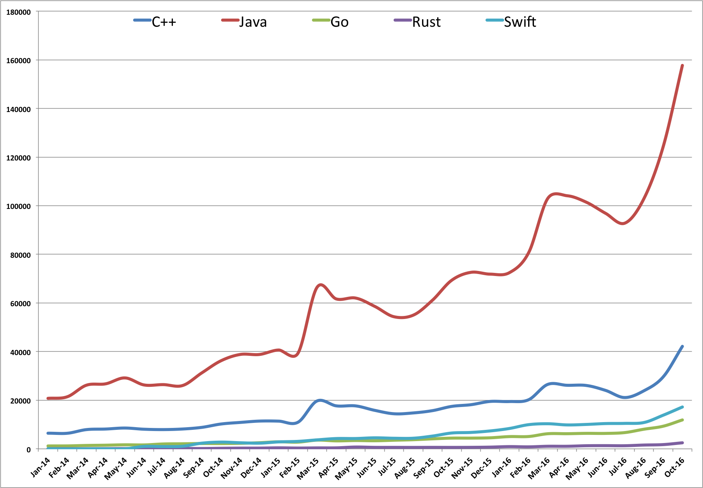

# Number of active repositories in GitHub

**Per language** and **per month**
 
Here are the current results from 2014 to 2016 (until october)

### 2014 statistics

| Language | Jan   | Feb   | Mar   | Apr   | May   | Jun   | Jul   | Aug   | Sep   | Oct   | Nov   | Dec   |
| :---     |  ---: |  ---: |  ---: |  ---: |  ---: |  ---: |  ---: |  ---: |  ---: |  ---: |  ---: |  ---: |
| C++      |  6503 |  6411 |  7917 |  8154 |  8562 |  8072 |  7925 |  8163 |  8836 | 10216 | 10868 | 11422 |
| Java     | 20766 | 21414 | 26178 | 26748 | 29169 | 26278 | 26420 | 26041 | 31238 | 36233 | 38825 | 38814 |
| Go       |  1232 |  1221 |  1400 |  1508 |  1670 |  1623 |  2012 |  2088 |  2204 |  2190 |  2283 |  2528 |
| Rust     |   112 |    80 |    77 |   100 |   124 |   117 |   169 |   185 |   146 |   238 |   303 |   313 |
| Swift    |     0 |     0 |     0 |     0 |     0 |  1005 |   942 |  1077 |  2343 |  2777 |  2512 |  2344 |

### 2015 statistics

| Language | Jan   | Feb   | Mar   | Apr   | May   | Jun   | Jul   | Aug   | Sep   | Oct   | Nov   | Dec   |
| :---     |  ---: |  ---: |  ---: |  ---: |  ---: |  ---: |  ---: |  ---: |  ---: |  ---: |  ---: |  ---: |
| C++      | 11397 | 10929 | 19709 | 17684 | 17667 | 15829 | 14431 | 14771 | 15716 | 17459 | 18162 | 19497 |
| Java     | 40639 | 39273 | 66473 | 61641 | 62018 | 58580 | 54329 | 54980 | 61126 | 69324 | 72593 | 71850 |
| Go       |  2903 |  2767 |  3586 |  3283 |  3427 |  3331 |  3546 |  3762 |  4118 |  4417 |  4418 |  4547 |
| Rust     |   423 |   336 |   399 |   421 |   747 |   612 |   609 |   592 |   616 |   600 |   625 |   717 |
| Swift    |  2864 |  3079 |  3699 |  4242 |  4252 |  4542 |  4362 |  4376 |  5256 |  6511 |  6753 |  7366 |

### 2016 statistics

| Language | Jan   | Feb   | Mar    | Apr    | May    | Jun   | Jul   | Aug    | Sep    | Oct    | Nov   | Dec   |
| :---     |  ---: |  ---: |   ---: |   ---: |   ---: |  ---: |  ---: |   ---: |   ---: |   ---: |  ---: |  ---: |
| C++      | 19457 | 20193 |  26515 |  26144 |  26067 | 24053 | 21107 |  23883 |  29582 |  42153 |       |       |
| Java     | 72445 | 80629 | 103005 | 104095 | 101442 | 96881 | 92797 | 102902 | 124221 | 157682 |       |       |
| Go       |  5044 |  5077 |   6222 |   6233 |   6377 |  6354 |  6692 |   8076 |   9309 |  11895 |       |       |
| Rust     |   925 |   826 |   1065 |   1063 |   1285 |  1323 |  1285 |   1568 |   1755 |   2495 |       |       |
| Swift    |  8377 |  9948 |  10328 |   9846 |  10042 | 10403 | 10474 |  10832 |  13832 |  13832 |       |       |

## The Go program

If you want to fork or reuse this program, here are some useful informations.

This little GO program requests the
[GitHub API](https://developer.github.com/v3/search/#search-repositories)

A typical request for one language for one month is:
https://api.github.com/search/repositories?q=language%3AC%2B%2B%20pushed%3A2016-11

The program exposes the following resource:

http://localhost/{year}

A CSV file is returned.

The program is slow because to not exceed the current rate limit (10 requests/minute)