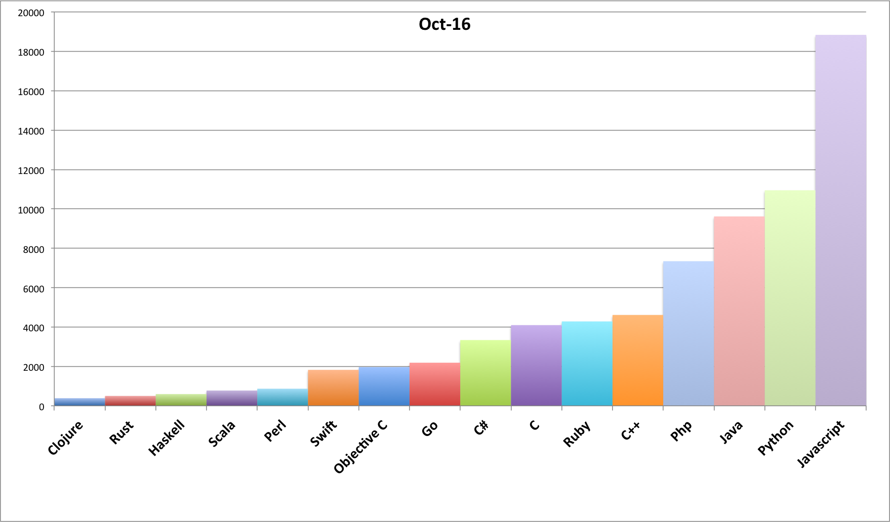
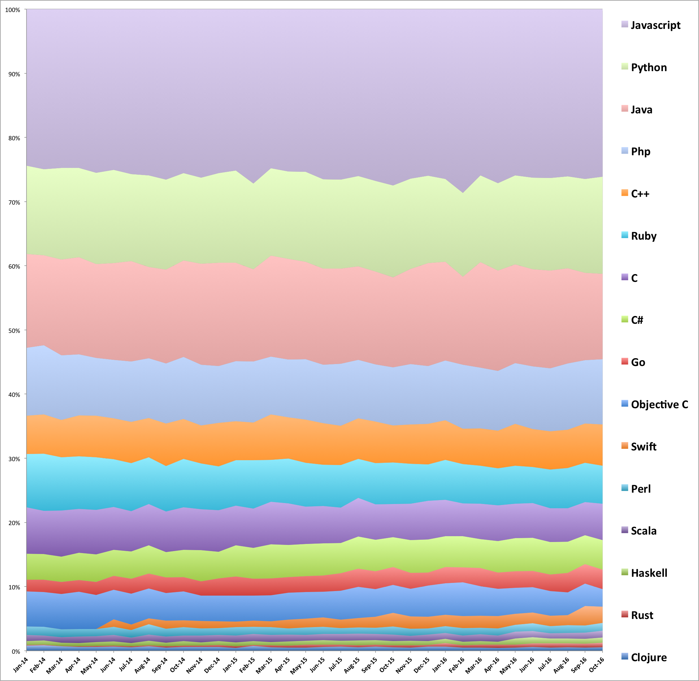

# Number of active repositories in GitHub

**Per language** and **per month**

An active repository should meet this requirements:
- created or updated during the evaluated period,
- at least one star,
- at least one fork,
- a size larger than 10 Kb.
 
## October 2016

## From 2014 to 2016

### 2014 statistics

| Language    | Jan    | Feb    | Mar    | Apr    | May    | Jun    | Jul    | Aug    | Sep    | Oct    | Nov    | Dec    |
| :---        |   ---: |   ---: |   ---: |   ---: |   ---: |   ---: |   ---: |   ---: |   ---: |   ---: |   ---: |   ---: |
| C           |    806 |    718 |    865 |    811 |    867 |    768 |    760 |    812 |    781 |    888 |    855 |    876 |
| C++         |    666 |    654 |    701 |    751 |    807 |    738 |    783 |    775 |    825 |    836 |    791 |    917 |
| C#          |    453 |    423 |    470 |    501 |    536 |    471 |    517 |    557 |    490 |    565 |    645 |    560 |
| Clojure     |     87 |     93 |     82 |     68 |     75 |     75 |     66 |     85 |     63 |     78 |     76 |     82 |
| Go          |    202 |    210 |    227 |    217 |    258 |    248 |    284 |    295 |    301 |    304 |    295 |    362 |
| Haskell     |     64 |     68 |     63 |     60 |     73 |     73 |     62 |     86 |     72 |     95 |     69 |     84 | 
| Java        |   1631 |   1498 |   1785 |   1789 |   1828 |   1741 |   1893 |   1795 |   1812 |   2018 |   2101 |   2174 |
| Javascript  |   2716 |   2664 |   2963 |   2925 |   3190 |   2890 |   3121 |   3272 |   3290 |   3420 |   3506 |   3452 |
| Objective C |    611 |    578 |    659 |    686 |    664 |    535 |    580 |    588 |    533 |    600 |    533 |    543 |
| Perl        |    145 |    141 |    149 |    141 |    139 |    149 |    145 |    208 |    153 |    176 |    149 |    142 |
| PHP         |   1176 |   1153 |   1205 |   1130 |   1129 |   1048 |   1144 |   1174 |   1155 |   1290 |   1266 |   1197 |
| Python      |   1535 |   1428 |   1715 |   1648 |   1773 |   1682 |   1649 |   1804 |   1738 |   1822 |   1790 |   1894 |
| Ruby        |    923 |    951 |    991 |    970 |   1026 |    862 |    908 |    920 |    875 |   1010 |    949 |    924 |
| Rust        |     14 |      9 |      7 |     17 |     20 |     18 |     16 |     23 |     22 |     29 |     31 |     38 |
| Scala       |    110 |     85 |     99 |    116 |    113 |    117 |    103 |    123 |    117 |    113 |    137 |    131 |
| Swift       |      0 |      0 |      0 |      0 |      0 |    131 |    107 |    111 |    155 |    145 |    155 |    143 |

### 2015 statistics

| Language    | Jan    | Feb    | Mar    | Apr    | May    | Jun    | Jul    | Aug    | Sep    | Oct    | Nov    | Dec    |
| :---        |   ---: |   ---: |   ---: |   ---: |   ---: |   ---: |   ---: |   ---: |   ---: |   ---: |   ---: |   ---: |
| C           |    895 |    829 |   1158 |   1137 |   1023 |   1011 |    979 |   1102 |   1044 |   1050 |    999 |   1118 |
| C++         |    883 |    793 |   1234 |   1139 |   1187 |   1128 |   1091 |   1159 |   1224 |   1174 |   1080 |   1177 |
| C#          |    703 |    650 |    931 |    887 |    878 |    873 |    842 |    929 |    927 |    950 |    913 |    962 |
| Clojure     |     65 |     98 |     96 |     87 |     89 |    100 |    112 |    102 |    118 |    115 |     90 |    119 |
| Go          |    432 |    356 |    463 |    427 |    438 |    439 |    479 |    520 |    527 |    567 |    432 |    385 |
| Haskell     |     88 |     81 |     90 |    121 |    108 |    124 |    106 |    137 |    135 |    129 |    132 |    112 |  
| Java        |   2227 |   1939 |   2754 |   2762 |   2674 |   2608 |   2629 |   2679 |   2734 |   2856 |   2629 |   2988 |
| Javascript  |   3651 |   3668 |   4334 |   4456 |   4463 |   4618 |   4718 |   4792 |   5048 |   5588 |   4680 |   4842 |
| Objective C |    586 |    523 |    706 |    734 |    727 |    702 |    805 |    899 |    812 |    883 |    762 |    904 | 
| Perl        |    190 |    149 |    210 |    173 |    206 |    197 |    161 |    179 |    176 |    255 |    197 |    176 |
| PHP         |   1355 |   1284 |   1575 |   1580 |   1654 |   1590 |   1713 |   1685 |   1686 |   1836 |   1671 |   1675 |
| Python      |   2081 |   1809 |   2378 |   2399 |   2460 |   2420 |   2460 |   2596 |   2664 |   2903 |   2496 |   2536 |
| Ruby        |   1030 |   1020 |   1142 |   1229 |   1205 |   1120 |   1173 |   1126 |   1208 |   1313 |   1110 |   1061 |
| Rust        |     39 |     25 |     49 |     49 |     76 |     65 |     58 |     56 |     63 |     62 |     57 |     49 |
| Scala       |    151 |    151 |    196 |    184 |    163 |    165 |    186 |    198 |    182 |    205 |    134 |    188 |
| Swift       |    129 |    131 |    161 |    242 |    240 |    253 |    233 |    264 |    322 |    431 |    343 |    341 |

### 2016 statistics

| Language    | Jan    |  Feb   | Mar    | Apr    | May    | Jun    | Jul    | Aug    | Sep    | Oct    | Nov    | Dec    |
| :---        |   ---: |   ---: |   ---: |   ---: |   ---: |   ---: |   ---: |   ---: |   ---: |   ---: |   ---: |   ---: |
| C           |   1166 |   1121 |   1349 |   1395 |   1448 |   1517 |   1547 |   1874 |   2292 |   4098 |        |        |
| C++         |   1260 |   1206 |   1417 |   1473 |   1748 |   1663 |   1749 |   2139 |   2714 |   4614 |        |        |
| C#          |    980 |   1066 |   1103 |   1231 |   1386 |   1433 |   1477 |   1745 |   2015 |   3339 |        |        |
| Clojure     |    135 |    111 |    117 |    112 |    133 |    165 |    150 |    200 |    223 |    387 |        |        |
| Go          |    511 |    511 |    701 |    633 |    693 |    715 |    767 |   1086 |   1341 |   2189 |        |        |
| Haskell     |    133 |    118 |    138 |    114 |    253 |    259 |    223 |    284 |    333 |    597 |        |        |
| Java        |   3132 |   3011 |   4033 |   3923 |   4137 |   4231 |   4483 |   5340 |   6055 |   9617 |        |        |
| Javascript  |   5399 |   6278 |   6357 |   6804 |   6965 |   7348 |   7736 |   9364 |  11769 |  18837 |        |        |
| Objective C |   1010 |   1155 |   1127 |   1070 |   1100 |   1103 |   1131 |   1283 |   1564 |   1966 |        |        |
| Perl        |    219 |    253 |    250 |    278 |    298 |    338 |    332 |    441 |    490 |    868 |        |        |
| PHP         |   1904 |   2181 |   2326 |   2324 |   2547 |   2727 |   2892 |   3702 |   4404 |   7343 |        |        |
| Python      |   2643 |   2862 |   3309 |   3417 |   3741 |   3988 |   4243 |   5146 |   6510 |  10944 |        |        |
| Ruby        |   1268 |   1342 |   1455 |   1453 |   1595 |   1566 |   1783 |   2263 |   2730 |   4285 |        |        |
| Rust        |    114 |     74 |    120 |    123 |    128 |    160 |    188 |    206 |    271 |    502 |        |        |
| Scala       |    184 |    214 |    255 |    247 |    280 |    272 |    241 |    306 |    429 |    776 |        |        |
| Swift       |    354 |    415 |    459 |    478 |    451 |    471 |    470 |    556 |   1352 |   1826 |        |        |

## The Go program

If you want to fork or reuse this program, here are some useful informations.

This little GO program requests the
[GitHub API](https://developer.github.com/v3/search/#search-repositories)

A typical request for one language for one month is:
https://api.github.com/search/repositories?q=stars:>0+forks:>0+size:>10+language:%22Swift%22+pushed:2016-11-01..2016-11-30

The program exposes the following resource:

http://localhost/

A CSV file is returned.

The program wait 7 seconds between each request to not exceed the current GitHub rate limit (10 requests/minute)
