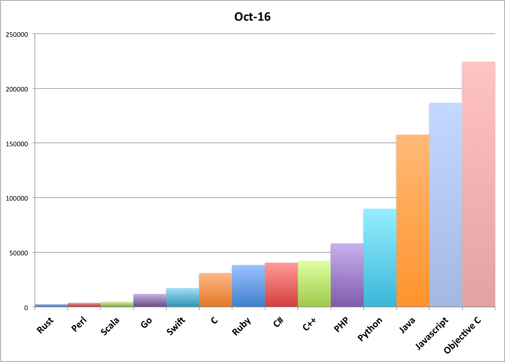
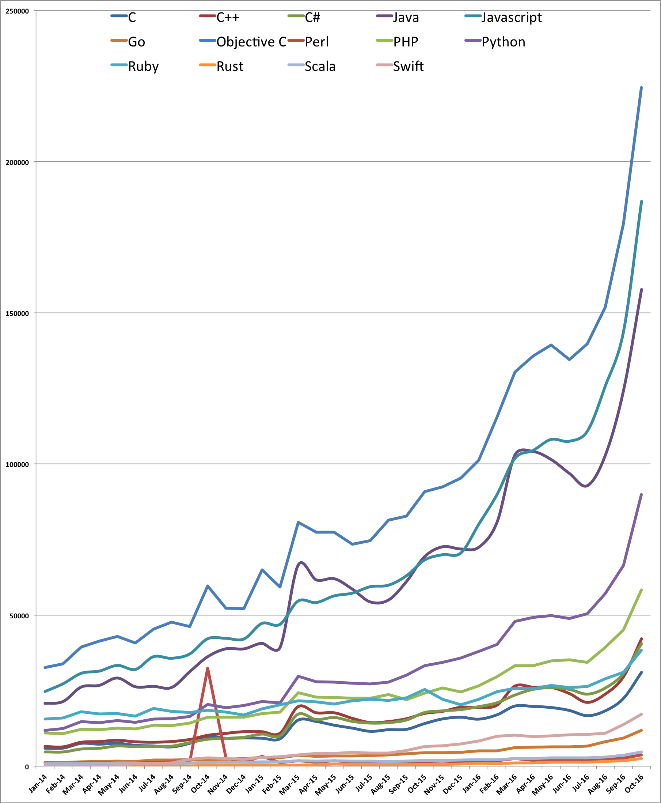
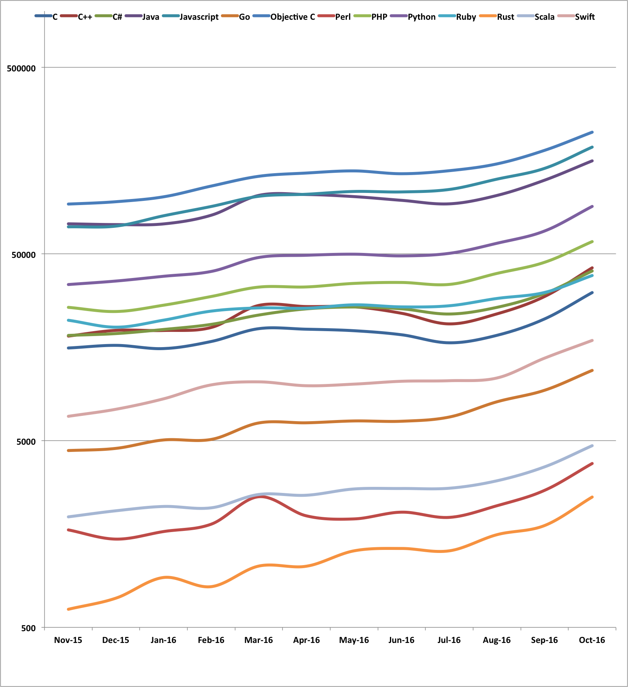

# Number of active repositories in GitHub

**Per language** and **per month**

An active repository is a repository which has been created or updated.
 
## October 2016

## From 2014 to 2016 (linear)

## Last 12 months (log)

### 2014 statistics

| Language    | Jan   | Feb   | Mar   | Apr   | May   | Jun   | Jul   | Aug   | Sep   | Oct   | Nov   | Dec   |
| :---        |  ---: |  ---: |  ---: |  ---: |  ---: |  ---: |  ---: |  ---: |  ---: |  ---: |  ---: |  ---: |
| C           |  5973 |  5983 |  7551 |  7288 |  7579 |  6904 |  6681 |  6375 |  7574 |  9754 |  9254 |  9340 |
| C++         |  6503 |  6411 |  7917 |  8154 |  8562 |  8072 |  7925 |  8163 |  8836 | 10216 | 10868 | 11422 |
| C#          |  4771 |  4713 |  5680 |  5926 |  6696 |  6445 |  6567 |  6633 |  7795 |  8916 |  9217 |  9576 |
| Go          |  1232 |  1221 |  1400 |  1508 |  1670 |  1623 |  2012 |  2088 |  2204 |  2190 |  2283 |  2528 |
| Java        | 20766 | 21414 | 26178 | 26748 | 29169 | 26278 | 26420 | 26041 | 31238 | 36233 | 38825 | 38814 |
| Javascript  | 24710 | 27288 | 30718 | 31468 | 33339 | 32029 | 36225 | 35706 | 37123 | 42169 | 42299 | 42081 |
| Objective C | 32597 | 33831 | 39377 | 41366 | 42975 | 40698 | 45319 | 47639 | 46165 | 59613 | 52233 | 52080 |
| Perl        |  1051 |   992 |  1052 |  1082 |  1092 |  1107 |  1180 |  1404 |  1428 | 32410 |  2758 |  1268 |
| PHP         | 11041 | 10753 | 12185 | 12061 | 12517 | 12272 | 13543 | 13471 | 14260 | 16262 | 16210 | 16201 |
| Python      | 11795 | 12451 | 14713 | 14337 | 15079 | 14529 | 15655 | 15711 | 16412 | 20484 | 19342 | 20044 |
| Ruby        | 15599 | 16003 | 18016 | 17250 | 17463 | 16580 | 19114 | 18102 | 17729 | 18552 | 17927 | 16985 |
| Rust        |   112 |    80 |    77 |   100 |   124 |   117 |   169 |   185 |   146 |   238 |   303 |   313 |
| Scala       |   870 |   856 |   865 |   933 |  1082 |  1089 |  1017 |   991 |  1074 |  1234 |  1272 |  1322 |
| Swift       |     0 |     0 |     0 |     0 |     0 |  1005 |   942 |  1077 |  2343 |  2777 |  2512 |  2344 |

### 2015 statistics

| Language    | Jan   | Feb   | Mar   | Apr   | May   | Jun   | Jul   | Aug   | Sep   | Oct   | Nov   | Dec   |
| :---        |  ---: |  ---: |  ---: |  ---: |  ---: |  ---: |  ---: |  ---: |  ---: |  ---: |  ---: |  ---: |
| C           |  9260 |  9064 | 15241 | 14795 | 13560 | 12591 | 11538 | 12067 | 12210 | 14105 | 15653 | 16198 |
| C++         | 11397 | 10929 | 19709 | 17684 | 17667 | 15829 | 14431 | 14771 | 15716 | 17459 | 18162 | 19497 |
| C#          | 10627 | 10058 | 17199 | 15441 | 16112 | 14822 | 14257 | 14418 | 15281 | 17759 | 18313 | 18731 |
| Go          |  2903 |  2767 |  3586 |  3283 |  3427 |  3331 |  3546 |  3762 |  4118 |  4417 |  4418 |  4547 |
| Java        | 40639 | 39273 | 66473 | 61641 | 62018 | 58580 | 54329 | 54980 | 61126 | 69324 | 72593 | 71850 |
| Javascript  | 47234 | 46948 | 54630 | 54132 | 56344 | 57247 | 59390 | 59881 | 63032 | 68212 | 69975 | 70520 |
| Objective C | 65001 | 59259 | 80667 | 77413 | 77359 | 73474 | 74640 | 81358 | 82691 | 90888 | 92348 | 95260 |
| Perl        |  3234 |  1250 |  1798 |  1377 |  1769 |  1317 |  1312 |  1470 |  1505 |  1560 |  1662 |  1485 |
| PHP         | 17435 | 17900 | 24292 | 22901 | 22785 | 22526 | 22443 | 23663 | 22031 | 24167 | 25890 | 24594 |
| Python      | 21413 | 20890 | 29747 | 27976 | 27809 | 27394 | 27244 | 27826 | 30118 | 33225 | 34299 | 35811 |
| Ruby        | 18942 | 20337 | 21702 | 21269 | 20565 | 21614 | 22125 | 21761 | 22640 | 25408 | 22124 | 20275 |
| Rust        |   423 |   336 |   399 |   421 |   747 |   612 |   609 |   592 |   616 |   600 |   625 |   717 |
| Scala       |  1433 |  1479 |  1778 |  1682 |  1822 |  1694 |  1729 |  1626 |  1744 |  1987 |  1954 |  2106 |
| Swift       |  2864 |  3079 |  3699 |  4242 |  4252 |  4542 |  4362 |  4376 |  5256 |  6511 |  6753 |  7366 |

### 2016 statistics

| Language    | Jan    |  Feb   | Mar    | Apr    | May    | Jun    | Jul    | Aug    | Sep    | Oct    | Nov    | Dec    |
| :---        |   ---: |   ---: |   ---: |   ---: |   ---: |   ---: |   ---: |   ---: |   ---: |   ---: |   ---: |   ---: |
| C           |  15569 |  16988 |  19904 |  19770 |  19405 |  18456 |  16719 |  18332 |  22438 |  31058 |        |        |
| C++         |  19457 |  20193 |  26515 |  26144 |  26067 |  24053 |  21107 |  23883 |  29582 |  42153 |        |        |
| C#          |  19708 |  20986 |  23545 |  25404 |  25997 |  25417 |  23844 |  25884 |  30700 |  40536 |        |        |
| Go          |   5044 |   5077 |   6222 |   6233 |   6377 |   6354 |   6692 |   8076 |   9309 |  11895 |        |        |
| Java        |  72445 |  80629 | 103005 | 104095 | 101442 |  96881 |  92797 | 102902 | 124221 | 157682 |        |        |
| Javascript  |  80083 |  89816 | 101852 | 104463 | 108099 | 107482 | 110806 | 125817 | 143704 | 186834 |        |        |
| Objective C | 101205 | 115529 | 130352 | 135694 | 139299 | 134540 | 139650 | 151842 | 179472 | 224544 |        |        |        |
| Perl        |   1630 |   1785 |   2505 |   1978 |   1905 |   2070 |   1941 |   2241 |   2709 |   3773 |        |        |
| PHP         |  26585 |  29591 |  33234 |  33300 |  34783 |  35181 |  34351 |  39336 |  45122 |  58247 |        |        |
| Python      |  37972 |  40306 |  47896 |  49210 |  49869 |  48832 |  50398 |  57055 |  66363 |  89880 |        |        |
| Ruby        |  22107 |  24712 |  25701 |  25611 |  26705 |  26032 |  26401 |  28882 |  31104 |        |        |        |
| Rust        |    925 |    826 |   1065 |   1063 |   1285 |   1323 |   1285 |   1568 |   1755 |   2495 |        |        |
| Scala       |   2221 |   2184 |   2575 |   2551 |   2756 |   2772 |   2781 |   3048 |   3619 |   4700 |        |        |
| Swift       |   8377 |   9948 |  10328 |   9846 |  10042 |  10403 |  10474 |  10832 |  13832 |  13832 |        |        |

## The Go program

If you want to fork or reuse this program, here are some useful informations.

This little GO program requests the
[GitHub API](https://developer.github.com/v3/search/#search-repositories)

A typical request for one language for one month is:
https://api.github.com/search/repositories?q=language%3AC%2B%2B%20pushed%3A2016-11

The program exposes the following resource:

http://localhost/{year}

A CSV file is returned.

The program wait 7 seconds between each request to not exceed the current GitHub rate limit (10 requests/minute)
